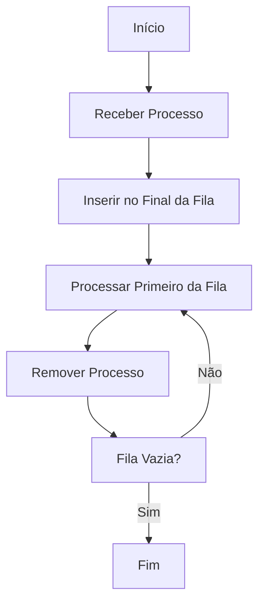
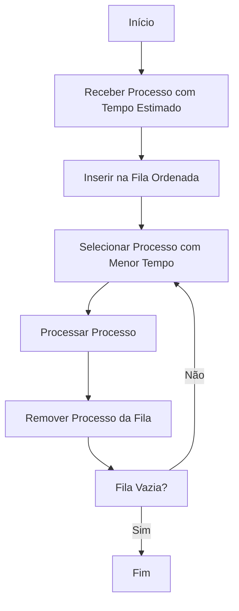
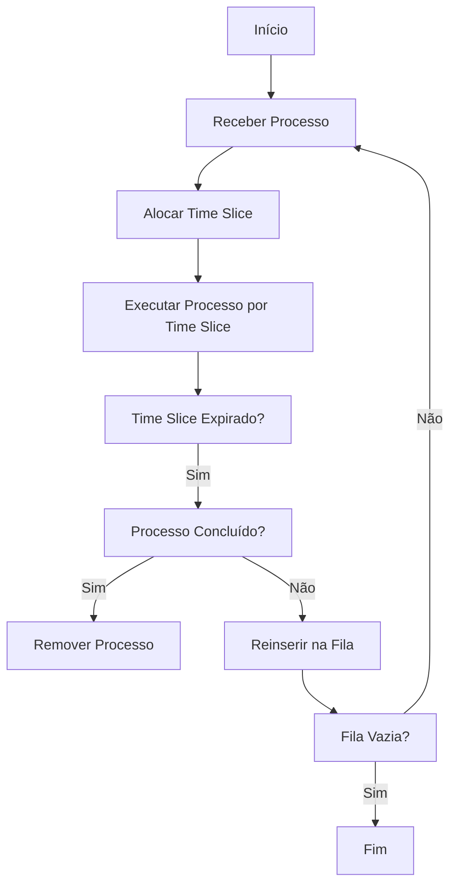
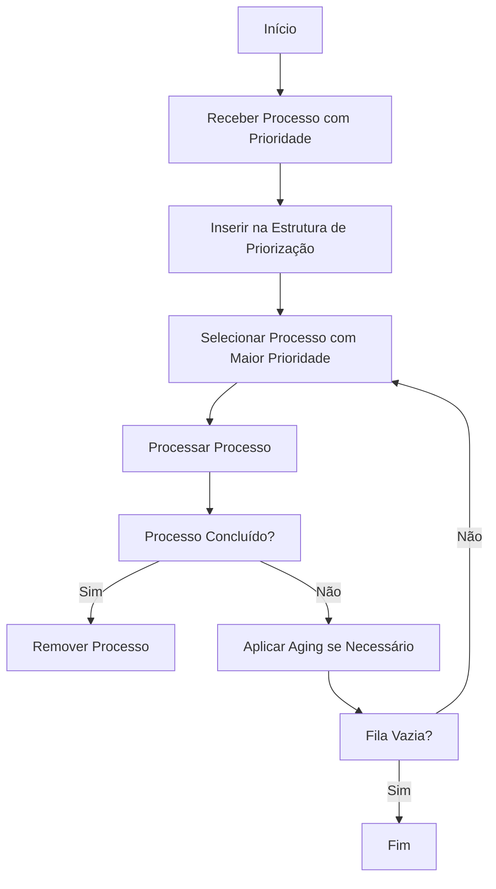

# Fundamentos Teóricos e Algoritmos de Gerenciamento de Processos 🚀

## 1. Fundamentos Teóricos

### 1.1. Processo 🖥️
Um **processo** é uma instância de um programa em execução, composto por:
- **Código executável**
- **Dados e variáveis**
- **Contexto de execução** (registradores, pilha, espaço de memória)

Cada processo possui seu próprio espaço de endereço, garantindo isolamento e segurança, o que é fundamental para a execução simultânea de múltiplas tarefas.

### 1.2. Threads 🔀
Uma **thread** é a menor unidade de execução dentro de um processo. Diferentemente dos processos, as threads compartilham:
- **Espaço de memória**
- **Recursos do processo**

Isso permite a execução concorrente, especialmente em sistemas com múltiplos núcleos, mas requer mecanismos de sincronização para evitar condições de corrida.

---

## 2. Algoritmos de Gerenciamento de Processos

Cada método é detalhado com sua descrição, complexidade algorítmica, casos de uso e um fluxograma elaborado com Mermaid.

### 2.1. Sistemas Operacionais Tradicionais

#### 2.1.1. FCFS (First Come, First Served) ⏱️
- **Descrição:**  
  Atende os processos na ordem de chegada, sem preempção.
- **Complexidade Algorítmica:**  
  - Inserção e remoção em fila: **O(n)**
- **Casos de Uso:**  
  - Sistemas batch e cenários onde a ordem de chegada é determinante.
- **Observações:**  
  - Método simples, mas pode causar alta latência para processos que chegam posteriormente.

**Fluxograma FCFS:**

---

#### 2.1.2. SJF (Shortest Job First) ⏳
- **Descrição:**  
  Prioriza a execução dos processos com o menor tempo de CPU estimado, reduzindo o tempo médio de espera.
- **Complexidade Algorítmica:**  
  - Utilização de estruturas ordenadas: **O(n log n)**
- **Casos de Uso:**  
  - Sistemas com tarefas de duração previsível.
- **Observações:**  
  - Pode levar à inanição de processos com tempos maiores e depende da precisão da estimativa.

**Fluxograma SJF:**

---

#### 2.1.3. Round Robin (RR) 🔄
- **Descrição:**  
  Cada processo recebe uma fatia de tempo (time slice) de forma cíclica; após a expiração, o processo é interrompido e reinserido na fila.
- **Complexidade Algorítmica:**  
  - Preempção: **O(1)** por ciclo; ciclo completo: **O(n)**
- **Casos de Uso:**  
  - Sistemas interativos onde a responsividade é essencial.
- **Observações:**  
  - A escolha do time slice é crucial para equilibrar a eficiência e a resposta do sistema.

**Fluxograma Round Robin:**

---

#### 2.1.4. Algoritmo de Prioridade ⭐
- **Descrição:**  
  Processos são escalonados com base em prioridades atribuídas. Pode ser preemptivo ou não-preemptivo, utilizando técnicas de envelhecimento (aging) para evitar inanição.
- **Complexidade Algorítmica:**  
  - Inserção em heap: **O(log n)**
- **Casos de Uso:**  
  - Ambientes onde certos processos são críticos (ex.: aplicações financeiras, controle industrial).
- **Observações:**  
  - Requer ajustes contínuos para evitar inanição de processos de baixa prioridade.

**Fluxograma do Algoritmo de Prioridade:**

---

# Conclusão
A evolução dos algoritmos de gerenciamento de processos apresenta métodos que vão desde abordagens simples e diretas até sistemas complexos que atendem a ambientes distribuídos e de tempo real. Cada algoritmo possui características específicas, variando em complexidade e aplicabilidade, conforme os requisitos do sistema. Este documento apresenta, de forma detalhada, os fundamentos teóricos, a análise da complexidade, casos de uso e fluxogramas interativos para facilitar o entendimento de cada método.
